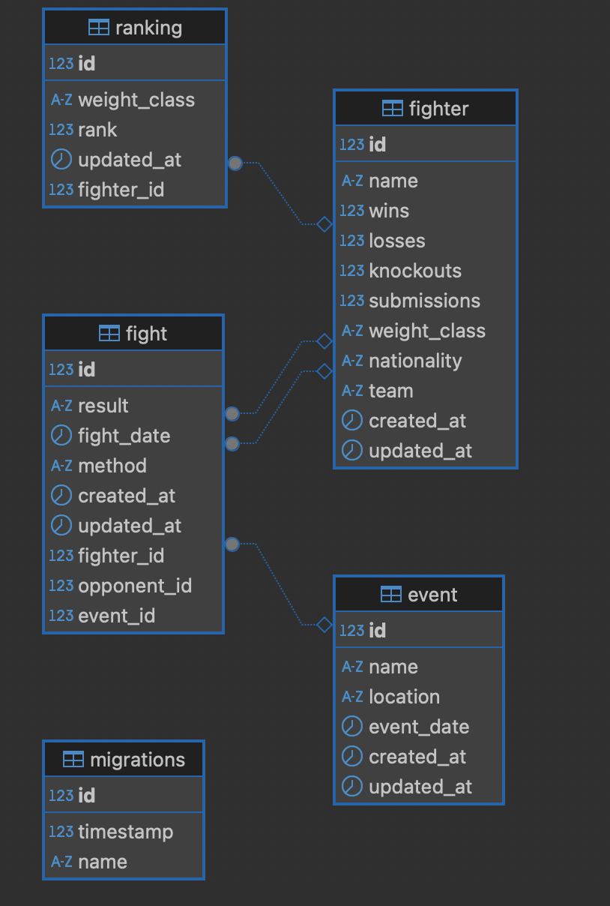

## Description
MMA app using GraphQL, NestJS, TypeORM

## ERD- Diagram



## SQL Queries

````sql
create table fighters (
id SERIAL PRIMARY KEY,
name TEXT NOT NULL,
wins INT NOT NULL DEFAULT 0,
losses INT NOT NULL DEFAULT 0,
knockouts INT NOT NULL DEFAULT 0,
submissions INT NOT NULL DEFAULT 0,
weight_class TEXT NOT NULL,
nationality TEXT NOT NULL,
team TEXT,
created_at TIMESTAMP DEFAULT CURRENT_TIMESTAMP,
updated_at TIMESTAMP DEFAULT CURRENT_TIMESTAMP
);

create table fights (
id SERIAL PRIMARY KEY,
fighter_id INT REFERENCES fighters(id),
opponent_id INT REFERENCES fighters(id),
fight_date DATE NOT NULL,
result TEXT CHECK(result IN ('win', 'loss', 'draw')),
method TEXT,
created_at TIMESTAMP DEFAULT CURRENT_TIMESTAMP,
updated_at TIMESTAMP DEFAULT CURRENT_TIMESTAMP
);

CREATE OR REPLACE FUNCTION update_updated_at_column()
RETURNS TRIGGER AS $$
BEGIN
  NEW.updated_at = CURRENT_TIMESTAMP;
  RETURN NEW;
END;
$$ LANGUAGE plpgsql;

CREATE TRIGGER set_updated_at
BEFORE UPDATE ON fighters
FOR EACH ROW
EXECUTE FUNCTION update_updated_at_column();

CREATE TRIGGER set_updated_at
BEFORE UPDATE ON fights
FOR EACH ROW
EXECUTE FUNCTION update_updated_at_column();


create table events (
id SERIAL PRIMARY KEY,
name TEXT NOT NULL,
location TEXT NOT NULL,
event_date DATE NOT NULL,
created_at TIMESTAMP DEFAULT CURRENT_TIMESTAMP,
updated_at TIMESTAMP DEFAULT CURRENT_TIMESTAMP
);

CREATE TRIGGER set_updated_at
BEFORE UPDATE ON events
FOR EACH ROW
EXECUTE FUNCTION update_updated_at_column();

ALTER TABLE fights
ADD COLUMN event_id INT REFERENCES events(id);

create table rankings (
id SERIAL PRIMARY KEY,
fighter_id INT REFERENCES fighters(id) ON DELETE CASCADE,
weight_class TEXT NOT NULL,
rank INT NOT NULL,
updated_at TIMESTAMP DEFAULT CURRENT_TIMESTAMP
);

CREATE TRIGGER set_updated_at
BEFORE UPDATE ON rankings
FOR EACH ROW
EXECUTE FUNCTION update_updated_at_column();

## Installation

```bash
$ npm install
````

## Running the app

```bash
# development
$ npm run start

# watch mode
$ npm run start:dev

# production mode
$ npm run start:prod
```
